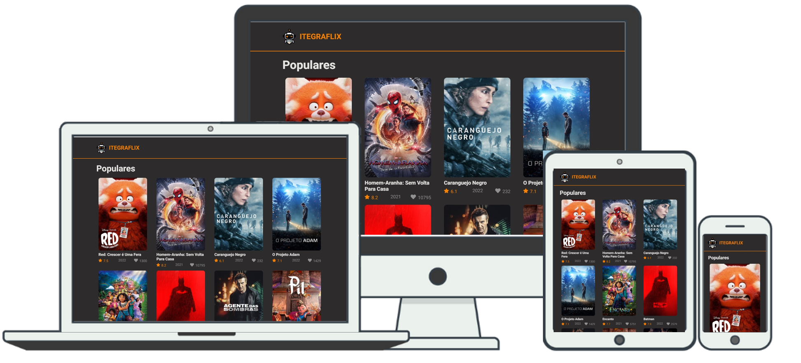

# [ItegraFlix](https://mardonioeng.github.io/itegraflix/)




> Uma aplicação desenvolvida em React que lista os 10 filmes mais populares da atualidade de acordo com a base de dados do [TMBD](https://www.themoviedb.org/)

## 🔗Link da aplicação
Esta aplicação está hospedada no GitHub Pages. Você consegue acessá-la em: <br>
 ➡️ https://mardonioeng.github.io/itegraflix/

## 📱Responsividade

A responsividade desta aplicação se baseia nos breakpoints padrões do Bootstrap5: <br>

Para mais detalhes, acesse: https://getbootstrap.com/docs/5.0/layout/breakpoints/

## 🛠️Tecnologias utilizadas

|                      | **Versão** | **Descrição**                                                |
| :------------------- | ---------- | ------------------------------------------------------------ |
| **React**            | 17.0.2     | Biblioteca JavaScript de código aberto com foco em criar interfaces de usuário em páginas web. |
| **Typescript**       | 4.6.3      | Superset da linguagem de programação JavaScript.             |
| **Bootstrap**        | 5.1.3      | Framework web com código-fonte aberto para desenvolvimento de componentes de interface. |
| **Axios**            | 0.26.1     | Cliente HTTP baseado em promises para fazer requisições.     |
| **React-router-dom** | 5.2.0      | Pacote npm que permite implementar roteamento dinâmico em aplicações web. |
| **Gh-pages**         | 3.2.3      | Plugin utilizado para fazer o deploy de aplicações estáticas para o GitHub |
| **Yarn**             | 1.22.17    | Sistema de gerenciamento de pacotes para JavaScript          |

## 🚀 Instalando o projeto

Depois de realizar o clone deste projeto (git clone), para instalar as dependências, use:

```shell
yarn
```

Se você não tem uma *key* para consumir a API TMDB, siga as orientações disponíveis na [Documentação da API](https://developers.themoviedb.org/4/getting-started/authorization) e então crie um arquivo na raiz do projeto chamado `.env` e atualize o valor da chave `REACT_APP_API` com sua *api key*.<br>

Para iniciar a aplicação na máquina local, use:

```shell
yarn start
```

Para fazer o deploy da aplicação, siga as orientações disponíveis na [Documentação do Create-react-app](https://create-react-app.dev/docs/deployment/#github-pages) e então use o seguinte comando:

```shell
yarn deploy
```

## 📘 Referências

- Esta aplicação utiliza dados públicos da API TMDB.
  - :link: https://developers.themoviedb.org/4/getting-started
- O mecanismo de Loading (feedback visual de carregamento dos dados) foi desenvolvido utilizando CSS3. Tomou-se como base o exemplo disponível em:
  - :link: https://www.w3schools.com/howto/howto_css_loader.asp
